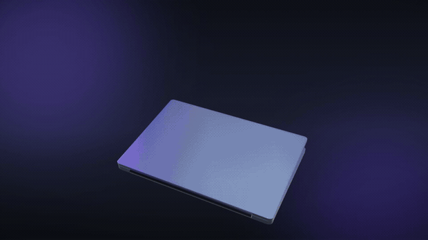
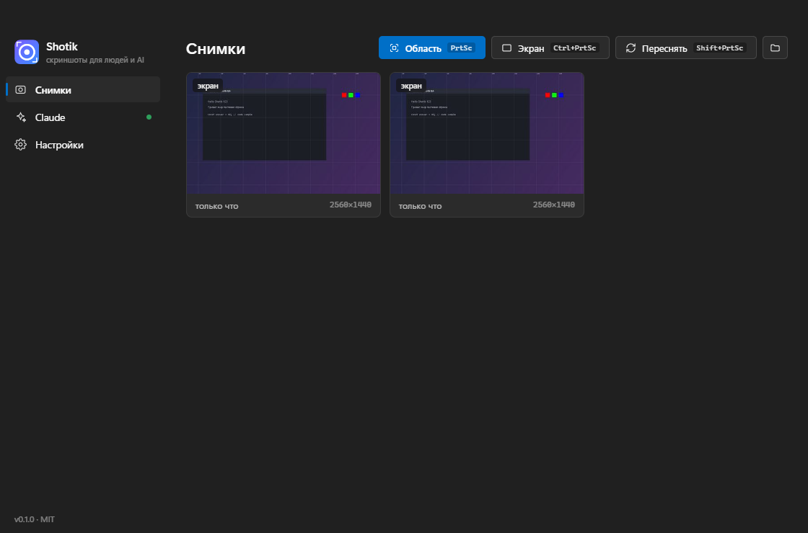
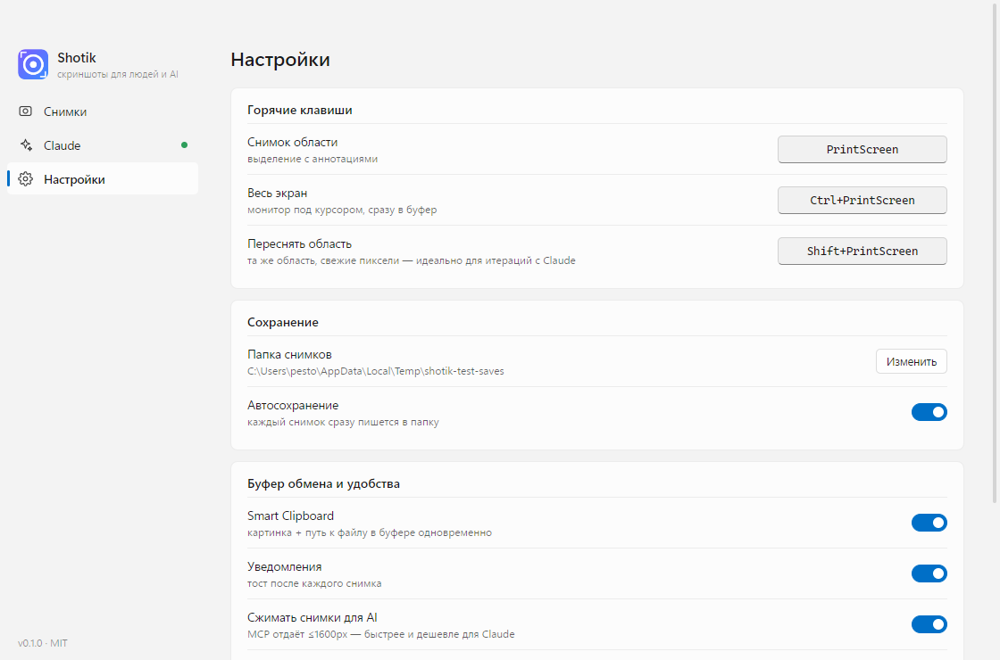

<p align="center">
  
</p>

<h1 align="center">Shotik</h1>

<p align="center">
  <b>Screenshots for humans & AI</b> · a beautiful open-source screenshot tool for Windows<br>
  with a built-in MCP server — Claude can see your screen
</p>

<p align="center">
  <a href="README.ru.md">Русская версия →</a>
</p>

<p align="center">
  <a href="https://github.com/gorka2354/shotik/releases/latest"></a>
  <a href="https://github.com/gorka2354/shotik/releases"></a>
  
  <a href="LICENSE"></a>
  
</p>

---

<p align="center">
  
</p>
<p align="center"><i>capture → annotate → OCR → one keypress to Claude · <a href="docs/promo.mp4">full-quality mp4</a></i></p>

<p align="center">
  
  
</p>
<p align="center"><i>the UI follows your system theme and Windows accent color · English & Russian interface</i></p>

## Why another screenshot tool?

Shotik is ShareX-style region capture with annotations, built around two ideas:

1. **AI-first.** Screenshots today often go to Claude/ChatGPT in a console, not to people.
   Shotik makes that zero-friction.
2. **Speed without dialogs.** Capture → already in the clipboard, already on disk, ready to paste.

## Features

### ✦ Smart Clipboard
After every capture the clipboard holds **both formats at once**: the PNG image and the file path as text.
`Ctrl+V` into Claude Code pastes the image; `Ctrl+V` into a plain terminal pastes the path. No switching.

### ✦ Built-in MCP server
Connect once:

```bash
claude mcp add shotik --transport http http://127.0.0.1:7464/mcp
```

and Claude gets these tools:

| Tool | What it does |
|---|---|
| `take_screenshot` | look at the screen right now |
| `ask_user_to_select_region` | open the overlay so **you** point at the area |
| `get_last_screenshot` | grab your latest shot |
| `take_screenshot_region` | capture a specific rectangle |
| `list_screenshots`, `list_displays` | history and monitors |

Say “look at my screen” — and Claude sees it. Say “look here” — and just draw a box with your mouse.

### ✦ Repeat last area (`Shift+PrtSc`)
Same region, fresh pixels, instant, no overlay. Perfect for iteration loops:
fix the CSS → `Shift+PrtSc` → `Ctrl+V` to Claude → “see it now?”. Survives restarts.

### ✦ Live Text — grab & translate text from anything (`Ctrl+Shift+PrtSc`)
Select an area and the recognized words become **selectable, right on the frozen screen** — like
macOS Live Text. Drag to grab exactly the words you want, `Enter` to copy, or hit **Translate** to
turn them into your language in a click. Works on screenshots, videos, PDFs, error dialogs — anything
on screen. Offline OCR (Russian + English + your Windows languages); translation works out of the box
(free) or via your own DeepL key. Better than PowerToys Text Extractor — that one just dumps everything.

### ✦ Flameshot-style overlay with annotations
Freeze-frame, magnifier with pixel-perfect HEX picker, boxes, arrows, pen, highlighter,
**pixelate your secrets**, text, numbered markers — all inside the overlay, before saving.
Hovering highlights the window under the cursor; click captures it (hold `Alt` to disable snapping).

### ✦ PowerToys Command Palette / Win+S
The installer adds Start Menu commands that show up in PowerToys Command Palette and Windows search:
**Shotik Area Screenshot**, **Shotik Full Screen**, **Shotik Repeat Last Area**.
CLI works too: `Shotik.exe --capture region|full|repeat`.

### ✦ And the rest
- **Pin** a shot on top of every window exactly where you cut it (wheel = zoom, right-click = menu)
- **OCR** the selection via built-in Windows OCR (offline, your installed languages)
- **Color picker** — `C` in the overlay copies the pixel HEX
- History gallery, toasts with previews, multi-monitor, HiDPI
- **Native look**: light/dark theme and accent color come from the OS and switch live
- **English & Russian** UI (follows the system language, switchable in Settings)

## Hotkeys

| Action | Windows | macOS |
|---|---|---|
| Capture area | `PrtSc` | `⌘⇧2` |
| Full screen (monitor under cursor) | `Ctrl+PrtSc` | `⌘⇧1` |
| Repeat last area | `Shift+PrtSc` | `⌘⇧7` |
| Extract text (Live Text) | `Ctrl+Shift+PrtSc` | `⌘⇧4` |

In the overlay: `Enter`/double-click — copy · `Ctrl+S` — save as · `P` — pin · `T` — OCR ·
`A` — copy for Claude · `F` — whole screen · `1..0` — tools · `[` `]` — stroke width ·
`Ctrl+Z` — undo · arrows — nudge selection · `Esc` — cancel.

## Install

**Prebuilt:** [Releases](https://github.com/gorka2354/shotik/releases) →
`Shotik-Setup-x.x.x.exe` (installer with shortcuts) or `Shotik-x.x.x-portable.exe` (single file, no install).

**From source:**

```bash
git clone https://github.com/gorka2354/shotik && cd shotik
npm install
npm start
```

Windows 10/11 required (Node.js ≥ 20 for building from source). The app lives in the tray;
closing the window minimizes it, quit via the tray menu.

**macOS (experimental):** `.dmg` builds (arm64 & x64) are produced in Releases. Default hotkeys
are `⌘⇧2` / `⌘⇧1` / `⌘⇧7`; OCR uses Apple Vision; window hover-snap is Windows-only for now.
Builds are unsigned: right-click → Open on first launch, and grant Screen Recording permission.
The maintainers have no Mac — feedback and PRs are very welcome.

**Microsoft Store:** packaging is ready (`npm run dist:store` builds the MSIX), pending a
Partner Center listing — see [docs/STORE.md](docs/STORE.md).

**Monitors:** multi-monitor and mixed resolutions are fully supported (capture and overlay are
computed per display, HiDPI-aware). Known limitation: with *mixed* DPI scale factors the window
hover-snap highlight can be a couple of pixels off.

## For contributors: ghost mode

E2E tests never touch your desktop: windows are placed off-screen, the desktop is replaced by a
fixture image, global hotkeys are not registered, and everything is driven over HTTP `/test/*`
endpoints:

```powershell
$env:SHOTIK_TEST='1'; $env:SHOTIK_GHOST='1'
$env:SHOTIK_FAKE_SCREEN='test\fake-screen.png'
npm start -- --hidden
# POST http://127.0.0.1:7464/test/trigger {"mode":"region"}
# POST http://127.0.0.1:7464/test/input {"events":[...]}   — synthetic input
# POST http://127.0.0.1:7464/test/capture-page              — window UI snapshot
```

The README demo GIF is robot-filmed too: `node test/film-cinematic.js` drives the cursor with
eased steps (~200 frames + a manifest), and `node test/render-camera.js` applies a virtual
follow-camera (lazy cursor tracking + push-ins) and encodes the GIF.
Simple storyboard variant: `film-demo.js` + `make-gif.js`.

## Architecture

```
src/
  main/        main process: capture (desktopCapturer), history, OCR (WinRT / Apple Vision),
               MCP server (zero-deps streamable HTTP), windows, settings, i18n
  overlay/     selection overlay: canvas rendering, annotations, toolbar
  app/         main window: gallery, Claude page, settings
  pin/ toast/  pinned shots and notifications
```

The only runtime dependency is Electron. No bundlers, no frameworks, no native modules.

## License

MIT
