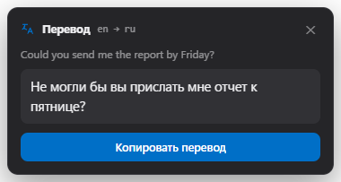
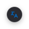
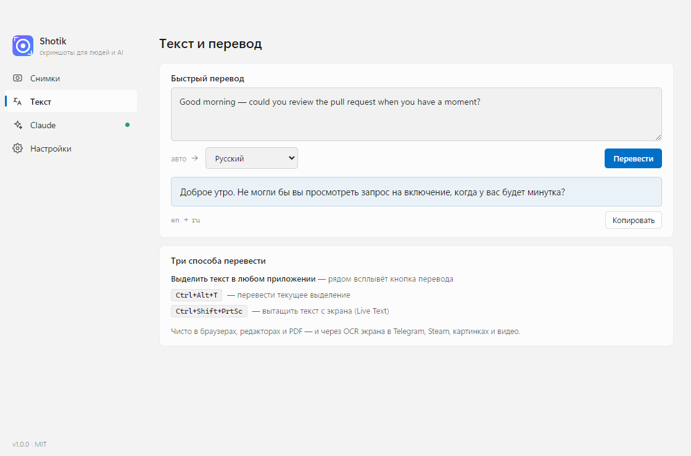

<p align="center">
  
</p>

<h1 align="center">Shotik</h1>

<p align="center">
  <b>Скриншоты и перевод для людей и AI</b> · красивая open-source утилита для Windows<br>
  со встроенным MCP-сервером (Claude видит твой экран) и переводом чего угодно на экране
</p>

<p align="center">
  <a href="README.md">English version →</a>
</p>

<p align="center">
  <a href="https://github.com/gorka2354/shotik/releases/latest"></a>
  <a href="https://github.com/gorka2354/shotik/releases"></a>
  
  <a href="LICENSE"></a>
  
  
</p>

---

<p align="center">
  
</p>
<p align="center"><i>захват → аннотации → OCR → одна клавиша до Claude · <a href="docs/promo.mp4">mp4 в полном качестве</a></i></p>

<p align="center">
  
  
</p>
<p align="center"><i>родной вид — тема и акцентный цвет из системы · русский и английский</i></p>

## Зачем Shotik?

Скриншоты сегодня чаще идут не в фотоальбом, а **в Claude/ChatGPT в консоль**, или в чат, или тебе нужен **текст внутри них**. Shotik сделан именно для этого:

- **AI-first.** Одна клавиша кладёт снимок прямо в Claude Code — правильно. Встроенный MCP-сервер позволяет Claude *самому* делать скриншоты.
- **Перевод всего, что видишь.** Выдели текст в любом приложении — или даже текст, вшитый в пост Telegram, страницу Steam, картинку или кадр видео — и получи мгновенный перевод. Без копипаста и вкладки браузера.
- **Скорость без диалогов.** Снял → уже в буфере, уже на диске, уже можно вставлять.
- **Лёгкий и честный.** Одна runtime-зависимость (Electron). Ни телеметрии, ни аккаунта, ни облака. ~0.5% одного ядра в простое (см. [Производительность](#производительность-и-приватность)).

По сути — ShareX-захват + аннотации Flameshot + переводчик уровня DeepL + Claude в одном маленьком MIT-приложении.

## ✨ Новое в 1.0 — перевод чего угодно на экране

<p align="center">
  
  &nbsp;&nbsp;
  
</p>

**Просто выдели текст — рядом всплывёт кнопка перевода; клик — и появляется перевод.** Работает тремя способами, от самого чистого:

1. **UI Automation** — в браузерах, редакторах, PDF, полях ввода: читает мгновенно, *буфер обмена не трогается*.
2. **OCR экрана** — в приложениях, которые рисуют текст сами (**посты Telegram, Steam**, картинки, кадры видео): Shotik находит подсветку выделения и распознаёт ровно те пиксели, что ты выделил. И тоже без буфера.
3. **`Ctrl+Alt+T`** — ручное сочетание, переводит текущее выделение где угодно.

Любишь печатать? Новая вкладка **Текст** — встроенный переводчик: вставил текст, выбрал язык, готово.

<p align="center">
  
</p>

Перевод работает **бесплатно из коробки** (без ключа) или по твоему ключу **DeepL**. Настоящая замена десктопному приложению DeepL — и достаёт текст, который DeepL не может (custom-drawn приложения, картинки, видео).

## Возможности

### ✦ Smart Clipboard
После каждого снимка в буфере лежат **оба формата сразу**: PNG-картинка и текстовый путь к файлу.
`Ctrl+V` в Claude Code вставит изображение, `Ctrl+V` в терминал — путь. Без переключений.

### ✦ Встроенный MCP-сервер
Подключи один раз:

```bash
claude mcp add shotik --transport http http://127.0.0.1:7464/mcp
```

и Claude получает инструменты: `take_screenshot` (посмотреть на экран), `ask_user_to_select_region`
(ты показываешь область мышкой), `get_last_screenshot`, `take_screenshot_region`, `list_screenshots`, `list_displays`.

Скажи «посмотри на экран» — и Claude видит его. «Посмотри сюда» — просто нарисуй рамку мышкой.

### ✦ Перевод выделенного текста — без скриншота *(1.0)*
Выдели текст в **любом** приложении — рядом появится кнопка перевода; клик — перевод. Читает выделение
через Windows UI Automation (без буфера) — и через OCR экрана с **детектом подсветки** в Telegram, Steam,
картинках и видео. Тумблер в **«Настройки → Текст и перевод»**; `Ctrl+Alt+T` и вкладка **Текст** тоже работают.

### ✦ Live Text — вытащи и переведи текст откуда угодно (`Ctrl+Shift+PrtSc`)
Выдели область — и распознанные слова становятся **выделяемыми прямо на замороженном экране**, как в
macOS Live Text. Тяни мышкой, `Enter` — копировать, или жми **Перевести**. Офлайн-OCR (языки Windows).
Лучше PowerToys Text Extractor — тот просто вываливает всё в буфер.

### ✦ Оверлей с аннотациями (Flameshot-style)
Заморозка экрана, лупа с HEX-пипеткой, рамки, стрелки, перо, маркер, **пикселизация секретов**,
текст, нумерованные маркеры — всё в оверлее, до сохранения. Наведение подсвечивает окно под курсором;
клик снимает его (`Alt` — отключить привязку, `Shift`+клик — весь экран).

### ✦ Переснять область (`Shift+PrtSc`)
Та же область, свежие пиксели, мгновенно, без оверлея — идеально для итераций с Claude:
поправил CSS → `Shift+PrtSc` → `Ctrl+V` в Claude → «теперь видно?». Работает после перезапуска.

### ✦ Запись экрана → видео или GIF (`Ctrl+Alt+PrtSc`)
Выдели область (или окно, или весь экран) и запиши в **WebM**: плавающая панель (таймер, пауза, стоп)
и живая красная рамка. Затем **любую запись можно экспортировать в GIF** в один клик. Опционально:
системный звук, 15–60 fps и отсчёт 3-2-1.

### ✦ PowerToys Command Palette / Win+S
Установщик добавляет команды в «Пуск», видимые в палитре команд PowerToys и поиске Windows:
**Снимок области**, **Весь экран**, **Переснять область**, **Перевести выделение**.
CLI тоже: `Shotik.exe --capture region|full|repeat|text|record|translate`.

### ✦ И остальное
- **Pin** — прилепить снимок поверх всех окон точно там, где вырезал (колесо = зум, ПКМ = меню)
- **Пипетка** — `C` в оверлее копирует HEX цвета пикселя
- История с галереей, тосты с превью, мультимонитор, HiDPI
- **Родной вид**: светлая/тёмная тема и акцентный цвет из системы, на лету
- **Русский и английский** интерфейс (по языку системы, переключается в настройках)

## Горячие клавиши

| Действие | Windows | macOS |
|---|---|---|
| Снимок области | `PrtSc` | `⌘⇧2` |
| Весь экран (монитор под курсором) | `Ctrl+PrtSc` | `⌘⇧1` |
| Переснять последнюю область | `Shift+PrtSc` | `⌘⇧7` |
| Вытащить текст (Live Text) | `Ctrl+Shift+PrtSc` | `⌘⇧4` |
| Запись области → видео / GIF | `Ctrl+Alt+PrtSc` | `⌘⇧6` |
| Перевести выделенный текст | `Ctrl+Alt+T` | `⌘⌥T` |

В оверлее: `Enter`/двойной клик — копировать · `Ctrl+S` — сохранить как · `P` — pin · `T` — OCR ·
`A` — для Claude · `F` — весь экран · `1..0` — инструменты · `[` `]` — толщина ·
`Ctrl+Z` — отмена · стрелки — сдвиг · `Esc` — выход.

## Установка

**Готовые сборки:** [Releases](https://github.com/gorka2354/shotik/releases) →
`Shotik-Setup-x.x.x.exe` (установщик) или `Shotik-x.x.x-portable.exe` (один файл, без установки).

**Из исходников:**

```bash
git clone https://github.com/gorka2354/shotik && cd shotik
npm install
npm start
```

Windows 10/11 (Node.js ≥ 20 для сборки). Приложение живёт в трее; выход — через меню трея.

**macOS (experimental):** в Releases собираются `.dmg` (arm64 и x64). OCR — через Apple Vision;
hover-snap и пузырь перевода пока только на Windows. Сборка не подписана: правый клик → «Открыть»
при первом запуске и разрешение «Запись экрана».

**Microsoft Store:** упаковка готова (`npm run dist:store` собирает MSIX) — см. [docs/STORE.md](docs/STORE.md).

## Производительность и приватность

Shotik должен раствориться в трее и ничего не стоить, пока он там.

- **CPU в простое ≈ 0.5% одного ядра** — практически ноль. Захват/запись работают только по требованию.
- **Ни телеметрии, ни аккаунта, ни сети** кроме запроса перевода, который ты сам вызвал (бесплатный
  сервис или твой ключ DeepL). Скриншоты остаются на твоём диске.
- **Одна runtime-зависимость: Electron.** Ни бандлеров, ни фреймворков, ни нативных модулей.
- **Watcher для перевода по выделению** — маленький фоновый хелпер (Windows UI Automation), который
  читает *есть ли* выделение; он не логирует клавиши и не трогает буфер обмена. Запускается **только**
  пока включён «Пузырь перевода при выделении», и его можно выключить в настройках. Процесс явно
  подписан (`selection-watch.ps1`) и сам завершается, если Shotik закрыт — ничего скрытого.

## Контрибьюторам: качество и ghost-режим

Тесты не касаются рабочего стола: окна за экраном, рабочий стол заменён фикстурой, глобальные хоткеи не
регистрируются, всё управляется по HTTP `/test/*`.

```bash
npm test          # юнит + ghost-интеграция (перевод, OCR, детект подсветки, пузырь, вкладка Текст)
npm run test:unit # быстро, без Electron
```

Набор покрывает то, что легко испортить незаметно: точность OCR (мелкий текст апскейлится; латиница vs
кириллица разводятся), детект подсветки выделения, гонки скрытия попапа, весь флоу перевода. Промо-видео
рендерится из кода через [motion-engine](https://www.remotion.dev/) (Remotion).

## Архитектура

```
src/
  main/        захват (desktopCapturer), история, OCR (WinRT / Apple Vision), перевод,
               watcher выделения + детект подсветки, MCP-сервер (zero-deps HTTP), окна, i18n
  overlay/     оверлей выделения: canvas, аннотации, тулбар
  app/         главное окно: галерея, страница Claude, вкладка Текст, настройки
  bubble/ translate-popup/ pin/ toast/   маленькие плавающие окна
```

## Лицензия

MIT
