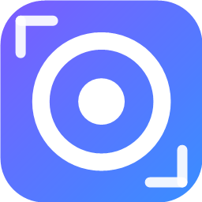
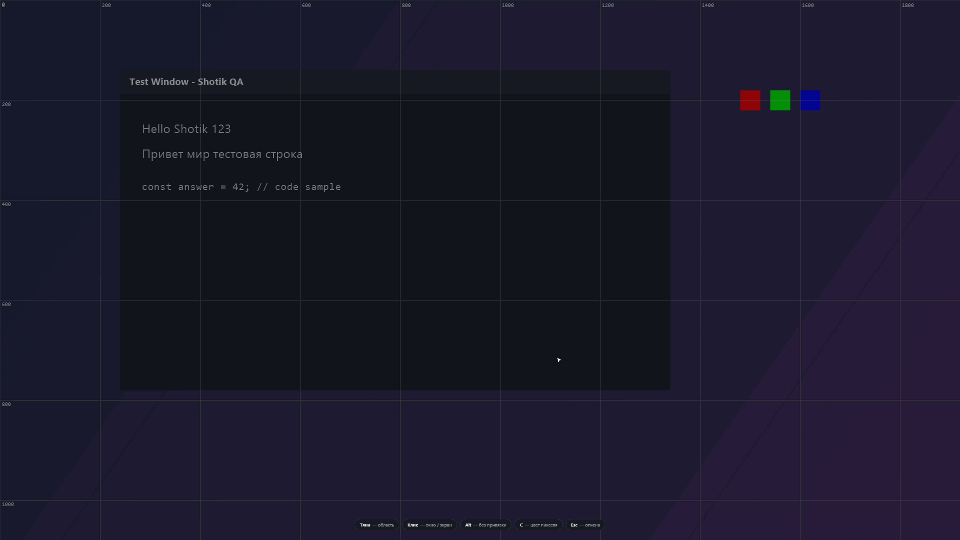

<p align="center">
  
</p>

<h1 align="center">Shotik</h1>

<p align="center">
  <b>Скриншоты для людей и AI</b> · красивый open-source скриншотер для Windows<br>
  со встроенным MCP-сервером — Claude может видеть твой экран
</p>

<p align="center">
  <a href="README.md">English version →</a>
</p>

<p align="center">
  <a href="https://github.com/gorka2354/shotik/releases/latest"></a>
  <a href="https://github.com/gorka2354/shotik/releases"></a>
  
  <a href="LICENSE"></a>
  
</p>

---

<p align="center">
  
</p>
<p align="center"><i>наведение подсвечивает окно → клик → стрелка, рамка, пикселизация, маркеры, текст → Enter → в буфере</i></p>

<p align="center">
  <a href="docs/promo.mp4"><b>▶ Промо-ролик (28 секунд)</b></a> — захват → аннотации → OCR → одна клавиша до Claude
</p>

## Зачем ещё один скриншотер?

Shotik — это ShareX-стиль захвата областей с аннотациями, но построенный вокруг двух идей:

1. **AI-first.** Скриншоты сегодня чаще показывают не людям, а Claude/ChatGPT в консоли.
   Shotik делает это нулевым трением.
2. **Скорость без диалогов.** Снял → уже в буфере, уже на диске, уже можно вставлять.

## Фишки

### ✦ Smart Clipboard
После каждого снимка в буфере обмена лежат **оба формата сразу**: PNG-картинка и текстовый путь к файлу.
`Ctrl+V` в Claude Code вставит изображение, `Ctrl+V` в обычный терминал — путь.

### ✦ Встроенный MCP-сервер
Подключи один раз:

```bash
claude mcp add shotik --transport http http://127.0.0.1:7464/mcp
```

и Claude получает инструменты: `take_screenshot` (посмотреть на экран), `ask_user_to_select_region`
(ты показываешь область мышкой), `get_last_screenshot`, `take_screenshot_region`, `list_screenshots`, `list_displays`.

### ✦ Переснять область (`Shift+PrtSc`)
Та же область, свежие пиксели, мгновенно, без оверлея — идеально для итераций с Claude. Работает после перезапуска.

### ✦ Оверлей с аннотациями (Flameshot-style)
Заморозка экрана, лупа с HEX-пипеткой, рамки, стрелки, перо, маркер, **пикселизация секретов**,
текст, нумерованные маркеры. Наведение подсвечивает окно под курсором; клик снимает его (`Alt` — отключить привязку).

### ✦ PowerToys Command Palette / Win+S
Установщик добавляет команды в меню «Пуск», которые видны в палитре команд PowerToys и поиске Windows:
**Shotik Area Screenshot**, **Shotik Full Screen**, **Shotik Repeat Last Area**.
CLI тоже работает: `Shotik.exe --capture region|full|repeat`.

### ✦ И остальное
- **Pin** — прилепить снимок поверх всех окон точно там, где вырезал (колесо = зум, ПКМ = меню)
- **OCR** — распознать текст из выделения (офлайн, русский + английский)
- **Пипетка** — `C` в оверлее копирует HEX цвета пикселя
- История с галереей, тосты с превью, мультимонитор, HiDPI
- **Родной вид**: светлая/тёмная тема и акцентный цвет из системы, на лету
- **Русский и английский** интерфейс (по языку системы, переключается в настройках)

## Горячие клавиши

| Действие | Windows | macOS |
|---|---|---|
| Снимок области | `PrtSc` | `⌘⇧2` |
| Весь экран (монитор под курсором) | `Ctrl+PrtSc` | `⌘⇧1` |
| Переснять последнюю область | `Shift+PrtSc` | `⌘⇧7` |

В оверлее: `Enter`/двойной клик — копировать · `Ctrl+S` — сохранить как · `P` — pin · `T` — OCR ·
`A` — для Claude · `F` — весь экран · `1..0` — инструменты · `[` `]` — толщина ·
`Ctrl+Z` — отмена · стрелки — сдвиг · `Esc` — выход.

## Установка

**Готовые сборки:** [Releases](https://github.com/gorka2354/shotik/releases) →
`Shotik-Setup-x.x.x.exe` (установщик) или `Shotik-x.x.x-portable.exe` (один файл, без установки).

**Из исходников:** `git clone https://github.com/gorka2354/shotik && cd shotik && npm install && npm start`
(Windows 10/11, Node.js ≥ 20). Приложение живёт в трее; выход — через меню трея.

**macOS (experimental):** в Releases собираются `.dmg` (arm64 и x64). OCR — через Apple Vision;
hover-snap пока только на Windows. Сборка не подписана: правый клик → «Открыть» при первом запуске
и разрешение «Запись экрана». Маков у мейнтейнеров нет — фидбек и PR welcome.

**Microsoft Store:** упаковка готова (`npm run dist:store` собирает MSIX), ждёт публикации
в Partner Center — см. [docs/STORE.md](docs/STORE.md).

## Контрибьюторам

Ghost-режим (e2e без касания рабочего стола), робосъёмка демо-GIF и архитектура — в
[английском README](README.md#for-contributors-ghost-mode).

## Лицензия

MIT
